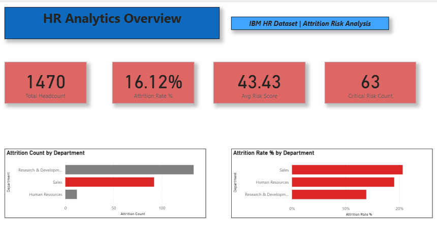
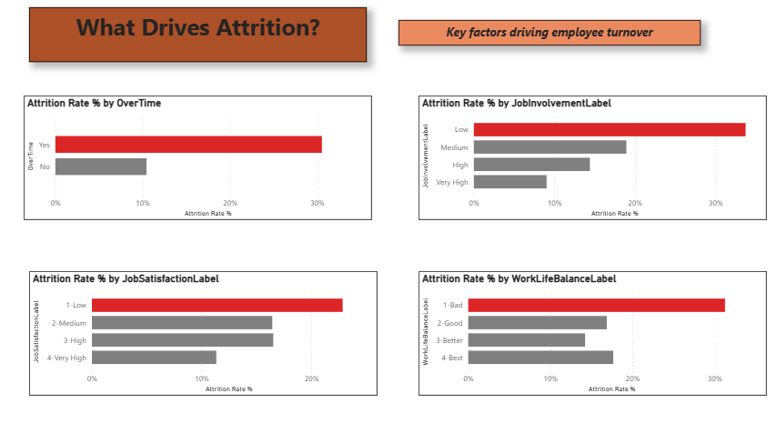
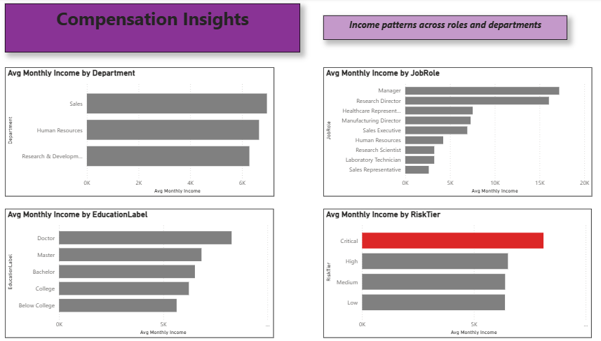
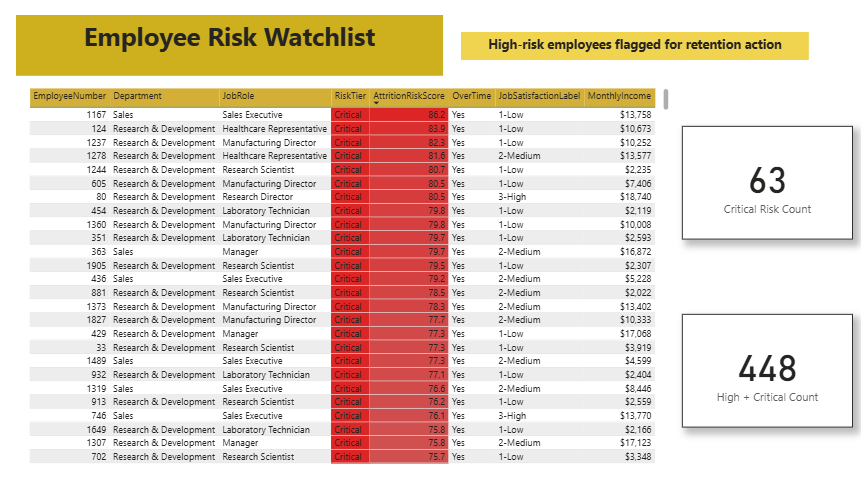

# HR Analytics: Employee Attrition Dashboard

**An interactive Power BI dashboard that identifies which employees are at risk of leaving — before they hand in their resignation.**

Built on IBM's HR Analytics Employee Attrition dataset (1,470 employees, 35 variables), this project goes beyond descriptive charts to deliver a working **attrition risk model** that HR teams can actually use to prioritize retention efforts.

---

## The Problem

Most HR attrition dashboards stop at description: "here's who left, here's when." They don't help HR act *before* someone leaves. This project asks a different question:

**Can we flag at-risk employees today, using signals we already have?**

---

## Approach

1. **Cleaned and engineered features** from the raw dataset in Python/Pandas (Jupyter notebook included)
2. **Built a custom Attrition Risk Score** — a weighted 0-100 score per employee, combining six known attrition predictors: overtime, job satisfaction, work-life balance, time since promotion, job involvement, and income relative to peers
3. **Validated the model** against real outcomes before trusting it (see Key Findings below)
4. **Designed a 5-page Power BI dashboard** to turn the analysis into something HR can actually use day to day

---

## Key Findings

### 1. The risk score works
Employees who actually left the company had an average risk score of **52.4**, compared to **41.7** for those who stayed — a gap validated *before* being used in the dashboard, not just assumed.

### 2. Overtime is the single strongest driver
Employees working overtime leave at a **30% rate**, compared to **10%** for those who don't — a 3x difference, and the highest-weighted factor in the risk model.

### 3. Pay doesn't explain the risk
Sales has the **highest attrition rate** (~20%) *and* the highest average income of any department. Critical-risk employees are not underpaid relative to their peers — meaning HR can't solve this with compensation alone. The real drivers are overtime, satisfaction, and career stagnation.

### 4. Count vs. rate tell different stories
Research & Development loses the most employees in raw numbers — but Sales has the *highest attrition rate*. A department-size-blind view (raw counts) would have pointed HR at the wrong team.

---

## The Risk Watchlist

The dashboard's core feature: a live-filterable table of every High and Critical risk employee (**63 Critical, 448 combined**), sorted by risk score, color-coded, ready for HR to act on directly — not just look at.

---

## Recommendations (What I'd Tell HR)

1. **Review overtime policy first** — it's the strongest lever available; even modest overtime reduction in high-risk teams could meaningfully cut attrition
2. **Don't default to pay raises for Sales retention** — the data doesn't support compensation as the fix; investigate workload, satisfaction, and manager relationships instead
3. **Use the Watchlist proactively** — check in with Critical-tier employees before their next review cycle, not after they've already decided to leave
4. **Re-validate the risk score quarterly** — as new attrition data comes in, re-run the validation check (Yes vs No group averages) to confirm the model still holds

---

## Dashboard Pages

| Page | What it shows |
|---|---|
| Overview | Headcount, attrition rate, avg risk score, department comparison |
| Attrition Drivers | Overtime, satisfaction, work-life balance, job involvement vs attrition |
| Compensation | Income by department, role, education, and risk tier |
| Workforce Demographics | Age, tenure, gender, department composition |
| Risk Watchlist | Filterable, color-coded table of high-risk employees |

---

## Tech Stack

- **Python (Pandas)** — data cleaning, feature engineering, risk score calculation
- **Power BI** — data modeling, DAX measures, interactive dashboard
- **Dataset**: [IBM HR Analytics Employee Attrition & Performance](https://www.kaggle.com/datasets/pavansubhasht/ibm-hr-analytics-attrition-dataset) (Kaggle)

---

## Files in This Repo

- `hr_attrition_cleaning.ipynb` — full data cleaning & feature engineering notebook
- `hr_attrition_cleaned.csv` — cleaned dataset used in Power BI
- `hr_analytics_dashboard.pbix` — the Power BI dashboard file (open with free Power BI Desktop)
- `hr_analytics_dashboard.pdf` — static preview of all 5 pages
- `screenshots/` — individual page previews

---

## How I'd Approach This for a Client

This project follows the same process I'd use for a real HR analytics engagement: understand the business question first (not just "make charts"), engineer features that are validated — not just assumed — against real outcomes, and design every page around a decision someone needs to make, not just data someone might find interesting. If you're looking for similar analysis on your own workforce or customer data, feel free to reach out.

---

**Author:** Syed Azib · [GitHub](https://github.com/SyedAzib)
